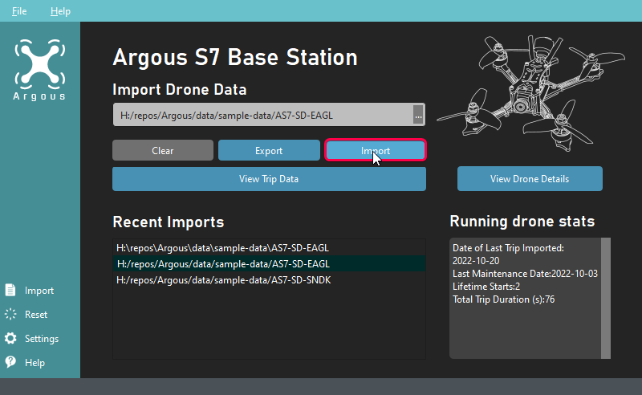
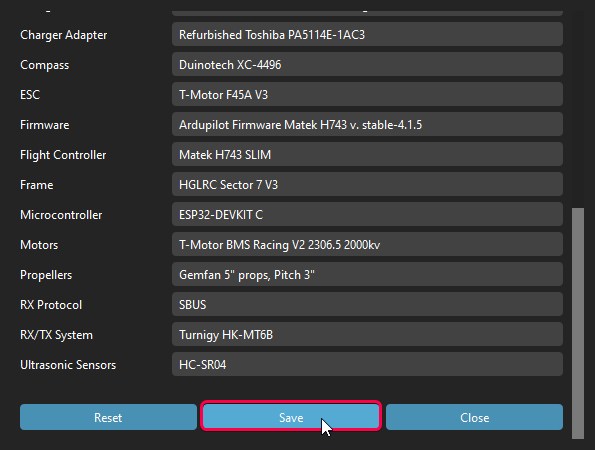
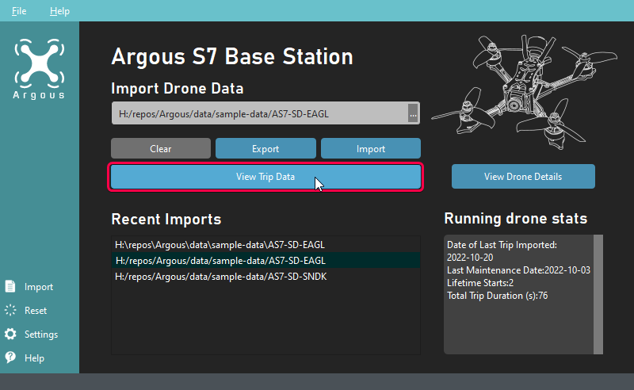
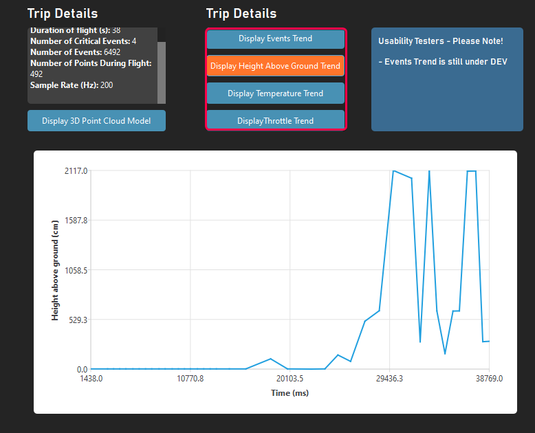
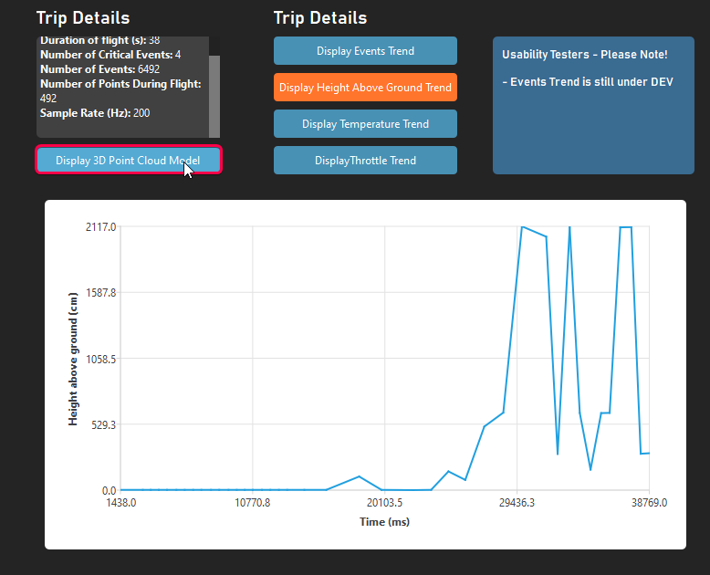
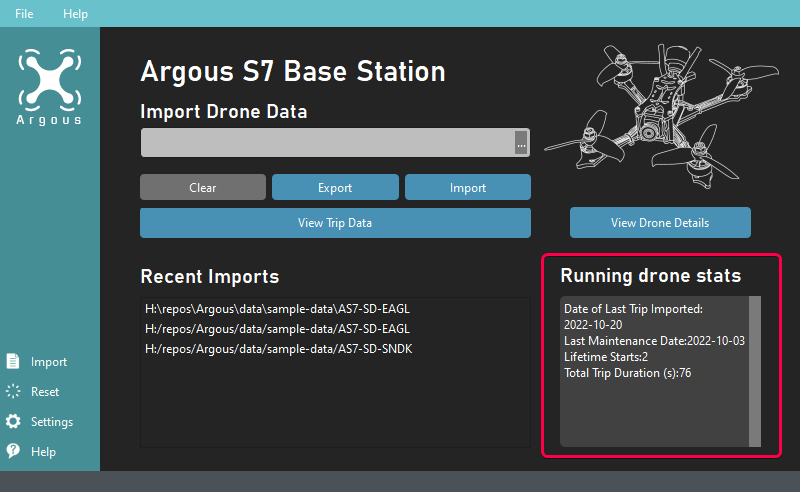

# AS7 Off-Board Software User Guide

## Outline

The Off-Board software, otherwise known as the Base Station Software, refers to the project desktop software. It is a Windows 10 application and processes the data gathered by the drone platform for visualisation and export. Qt Creator can be used to further develop the software. Environment and set-up instructions can be found on the [main page.](index.html)

This document provides an overview of the primary features of the off-board software.

## Table of Contents

- [AS7 Off-Board Software User Guide](#as7-off-board-software-user-guide)
  - [Importing Drone Data](#importing-drone-data)
  - [Viewing Trip Details](#viewing-trip-details)
  - [Exporting 3D Map](#exporting-3d-map)
  - [Software Features and Application Data](#software-features-and-application-data)

## Importing Drone Data

The on-board software does not fully process all captured data to reduce on-board processing requirements. This is done by the off-board or base station software using the outputs from the drone.

Data recorded by the drone is saved to the MicroSD card as part of the electronics package. These files are `as7.log` and`data.csv`. 

To import data from the drone:

1. Plug in the MicroSD Card to this computer using an adaptor
2. Press “Import” 
3. Locate the **folder** that the files are located in. This is typically found under “My Computer” and is the SD card itself
4. Press “Select Folder” and the data will begin importing.
5. There should be a prompt saying “Import Successful” if the import is successful.

*The Base Station Software highlighting the import button*

Imports can also be done on recently imported files to re-generate them.

1. Press on the recent file under “Recent Imports”
2. Press “Import”
3. There should be a prompt saying “Import Successful” if the import is successful.

#### Opening Drone Details

Drone details cannot be opened unless a file has been imported. Drone configuration is read from the import itself, and therefore a trip must be imported to view configuration details.

#### Editing Drone Details

The drone configuration can be edited through `as7.config` or through the base station software. This can be edited directly and saved or reset.

*The save button (scroll down) can be used to save the drone configuration and details*

#### Opening Trip Details Without Importing

The trip details can be opened and viewed if there has been no import. the previous import is loaded if no new import has been found.

## Viewing Trip Details

The details of the trip can be viewed by pressing on “View Trip Data” on the home page. 

*View Trip Data can be seen under the import box*

This will open the trips popup, which will contain information on the imported trip. Features of the trip details window are:

* An events trend, heights trend, temperature trend, and throttle trend, which can be switched between with the middle button cluster
* Trip details and statistics, such as the number of gathered points during the flight or the sample rate

*The plot can be changed to display different information by selecting the buttons from the main cluster*

### Using the 3D Scatter Plot

The 3D Scatter plot shows a representation of the points collected by the drone based on sensor position.

It can be accessed by going to “Trip Details” and then pressing on “Display 3D Point Cloud Model”

*Pressing ‘Display 3D Point Cloud Model’ will open the visualisation of the data points*

## Exporting 3D Map

The data can be exported by pressing “Export” on the home page or by going to ‘File > Export PLY’ in the toolbar.

The exported file is the most recent 3D Model. If the new trip data has not been exported yet, the exported model will be loaded from the previous trip.

## Software Features and Application Data

The Base Station Software is designed as a support tool for the main code modules with AS7. Information related to the running application can be found in the `appdata` repository, mostly containing temporary data. This includes:

* The default drone configuration
* The current drone details
* A copy of the most recent 3D Point Cloud
* A text file containing all recent file locations

The files can be edited and are all encoded as text files.

### Lifetime measurements

Lifetime measurements aim to provide the flight history for the drone. On every import, the statistics are updated. They can be found under “Running Drone Stats” on the homepage.

*Lifetime measurements for the drone are inferred from imports.*

### Using the AS7 Document Reference

The reference documentation can be viewed on the left hand pane. These documents contain a complete reference for the on-board software. An example could be the [class list](annotated.html).
